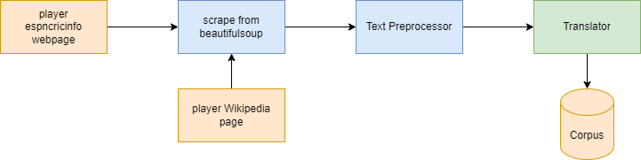
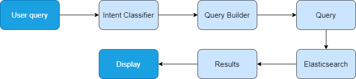
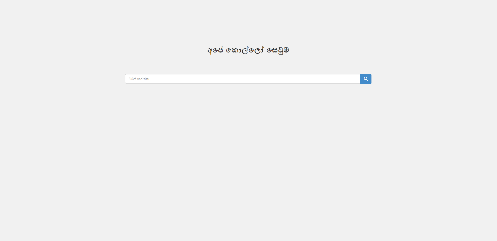
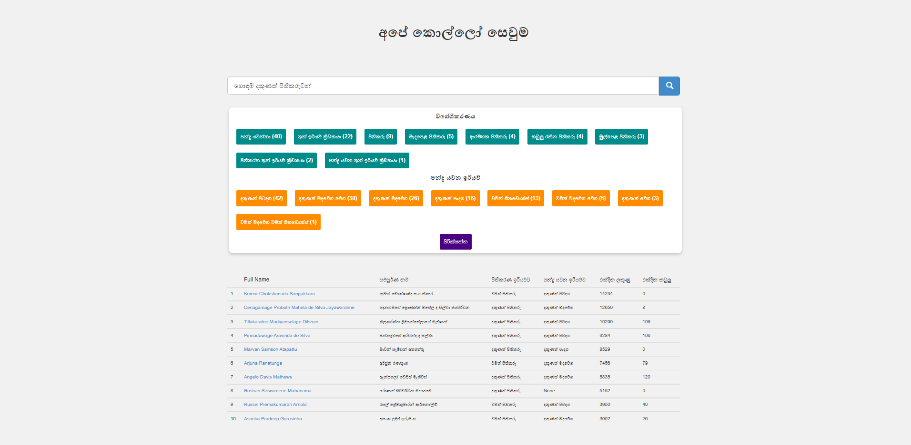
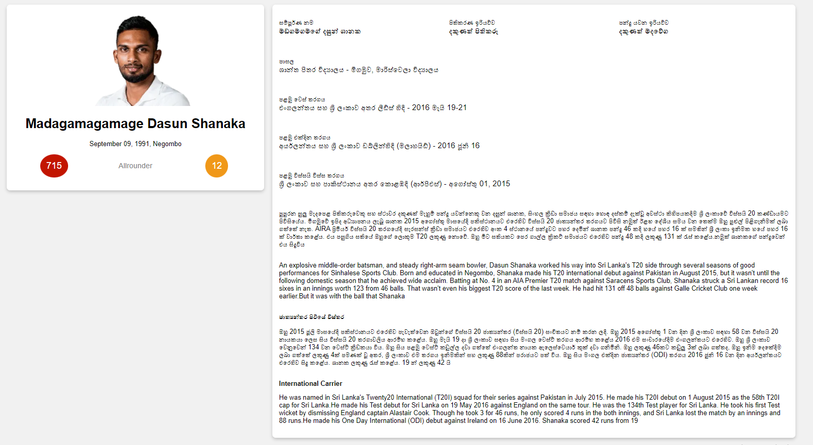

# Sri Lankan Cricketers Search Engine

This repository contains the source code of a search engine which can be used to query Sri Lankan ODI cricketers. This
Search engine was built using Elasticsearch and Flask. It supports both Sinhala and English language queries. The
information about Sri Lankan cricketers was extracted from the [espncricinfo.com] (https://www.espncricinfo.com/player)
website and wikipedia using the BeautifulSoup library.

## Directory Structure

```
├── corpus : scripts realated to data extraction and final corpus
    ├── corpus.json : initial corpus in english language
    ├── corpus_en_to_si_converter.py : convert english text to sinhala using googletrans api
    ├── corpus_preprocessor.py : script to reduce the text field size
    ├── final-corpus.json : final corpus in both english and sinhala languages
    ├── scraper.py : script to exract data espncricinfo.com and wikipedia              
├── objects : player class 
├── utils : utility functions
├── static : UI related CSS files
├── templates : UI HTML related files  
├── app.py : backend of the web app created using Flask
├── create_index.py : script to upload data to Elasticsearch
├── queries.py : script contains all queries
├── search.py : search functions for processing queries and returning results
├── queries.txt :  Example queries supported by search engine  
├── Settings.py :  ES configuration with host, port, and index name
├── requirements.txt : python dependencies

```

## Project Setup

First run the below commands to clone and install dependencies.
```
git clone https://github.com/LakshanWeerasinghe/Sri_Lankan_Cricketer_Search
cd Sri_Lankan_Cricketer_Search

pip install requirements.txt
```

Then update `Settings.py` file `flask_host`, `flask_port` and `es_url` fields and up the elasticsearch local server.
Finally, run the below commands to create index and run the flask server to search queries.

```
python create_index.py
python app.py
```

## Data fields

Each cricketer entry contains the following data fields. Biography and Internal Carrier are long text fields.

    1. Full Name ( English and Sinhala )
    2. Birthday 
    3. Batting Style ( English and Sinhala )
    4. Bowling Style ( English and Sinhala )
    5. Role ( English and Sinhala ) 
    6. Education ( English and Sinhala )
    7. Biography ( English and Sinhala )
    8. International Carrier ( English and Sinhala )
    9. Test debut ( English and Sinhala )
    10. ODI debut ( English and Sinhala )
    11. T20 debut ( English and Sinhala )
    12. ODI runs
    13. ODI wickets
    14. Espncricinfo website url

## Data Scraping

The [espncricinfo.com](https://www.espncricinfo.com/player) website was used to extract the information about Sri Lankan
ODI Cricketers. All the data fields mentioned above were extracted from this website apart from the “International
Career” field, which was extracted from Wikipedia. For this data extraction process, “BeautifulSoup” which is a HTML/XML
parsing library was used along with multithreading to speed up the process. In the Text Preprocessing step, authors
names, punctuations, and newline characters were removed. The aforementioned processing was done using simple text
replacements and regex operations. Then the cleaned data was passed to a translator to convert it into Sinhala language.
The fields “Biography”, “International carrier”, “Test debut”, “ODI debut”, and “T20 debut” were translated using the
“googletrans” api and other text fields such as “Role”, “Batting Style”, “Bowling Style”, and “Education” were
translated using predefined dictionaries. Finally, the final_corpus.json file was created..



## Search Engine

### Indexing

The standard indexing methods, mapping and analyzer provided by the Elasticsearch was used.

### Searching

First the user queries are it passed to the intent classifier, where four different intents can be identified. Then the
Elasticsearch query is build according to the user intent, and it will get executed. In here user also can specify the
result size so, that the default size get override. The search queries can be in Sinhala, English or in both Sinhala and
English language. For example queries, refer to `queries.txt` file.



## Advance Features

- Text mining and text preprocessing
    - Search queries are processed before intent classification, here punctuations removed and lowering english words
      happen.

- Intent Classification
    - Once the query is preprocessed intent behind the query is identified using Tokenization, word vectorization and
      cosine distance. Following are the four intents that can identified by the system.
      
    ```
    1. Top search queries
      eg : හොඳම පිතිකරුවන්, හොඳම ක්‍රීඩකයන් 7, top 5 bowlers
    
    2. Worst search queries
       eg : worst 5 batsmen, චොරම bowlers 6
    
    3. Field filtered queries
       eg : දකුණත් පිතිකරුවන් 8, වමත් පිතිකරු, මංගල තරගය බංග්ලාදේශය සමග, debut at Galle
    
    4. Phrase queries
       eg : "ඕස්ට්‍රේලියානු වේග පන්දු පුහුණුකරු", 'පිතිකරණය අලංකාරයට වඩා ඵලදායී'
    
    5. Multi match queries
       eg : දසුන්, ආනන්ද විද්‍යාලය, Muthiah Muralidaran
       
    ```
  
- Faceted Search
    - The search engine supported faceted search related to name, batting style and role.

- Bilingual support
    - The search engine supports only Sinhala, only English and Sinhala and English mixed queries.

- Synonyms support
    - The search engine also support synonyms and that can be either in Sinhala or in English. Following are few
      synonyms supported by the search engine.
      ```
      1. Top synonyms :
            eg : top, best, super, පට්ට, සුපිරිම, හොඳම
      2. Worest synonyms :
            eg : worst, bad, ugly, චොරම, චාටර්ම
      3. Other synonyms :
            eg : batter, batsmen, පිතිකරුවන්, ක්‍රීඩකයා
      ```

- Resistant to simple spelling errors
    - Due to the use of vectorization and distance calculation the search engine is resistant to small spelling errors
      and these are automatically corrected and related search results are generated.


## User Interfaces

1. Main Page
 <br/><br/>

   <br /><br />
2. Search Results Page
   <br/><br/>
   
   <br/><br/>
3. Player Details Page
   <br/><br/>
   

