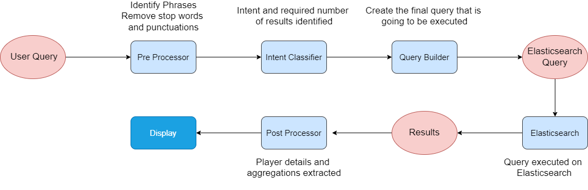

# Sri Lankan Cricketers Search Engine 
This repository contains source for a search engine that can used to query Sri Lankan
ODI cricketers. This information retrieval system was build using Elasticsearch and Flask.
This search engine supports both Sinhala and English language queries. The information 
about cricketers were extract from [espncricinfo.com](https://www.espncricinfo.com/player) 
and wikipedia using BeautifulSoup.


## Directory Structure

```
├── corpus : scripts realated to data extraction and final corpus
    ├── corpus.json : initial corpus in english language
    ├── corpus_en_to_si_converter.py : convert english text to sinhala using googletrans api
    ├── corpus_preprocessor.py : script to reduce the text field size
    ├── final-corpus.json : final corpus in both english and sinhala languages
    ├── scraper.py : script to exract data espncricinfo.com and wikipedia              
├── objects : player class 
    ├── Player.py : plyaer object class
├── templates : UI related files  
├── app.py : backend of the web app created using Flask
├── create_index.py : script to upload data to Elasticsearch
├── queries.py : script contains all queries
├── search.py : search functions for processing queries and returning results
├── queries.txt :  Example queries supported by search engine  
├── config.py :  ES configuration with host, port, and index name
```

## Data fields

Each cricketer entry contains the following data fields. Biography and Internal Carrier are long text fields.

    1. Full Name ( English and Sinhala )
    2. Birthday 
    3. Batting Style ( English and Sinhala )
    4. Bowling Style ( English and Sinhala )
    5. Role ( English and Sinhala ) 
    6. Education ( English and Sinhala )
    7. Biography ( English and Sinhala )
    8. International Carrier ( English and Sinhala )
    9. Test debut ( English and Sinhala )
    10. ODI debut ( English and Sinhala )
    11. T20 debut ( English and Sinhala )
    12. ODI runs
    13. ODI wickets
    14. Espncricinfo website url

## Data Scraping
The list of Sri Lankan ODI cricketers, in [espncricinfo.com](https://www.espncricinfo.com/player) used to extract 
information to the data fields mentioned above. But, International Carrier field was extracted from Wikipedia 
belongs to each player. This process used HTML/XML parsing library BeautifulSoup, and used multithreading to
speed up the process. In the Text Preprocessing step  authors names, punctuations and newline characters were removed.
Do to the aforementioned processing was done using simple text replacements and regex operations.<br />
Then cleaned data passed to translator convert it to Sinhala language. The Biography, International carrier, Test debut,
ODI debut and T20 debut was translated using googletrans api and, other text fields such as Role, Batting Style, Bowling
Style and Education was translated using predefined dictionaries. Finally, the final_corpus.json file created.


## Search Engine

### Indexing
The standard indexing methods, mapping and analyzer provided by the  Elasticsearch was used. 

### Searching
First the user queries are it passed to the intent classifier, where four different intents can be identified. 
Then the Elasticsearch query is build according to the user intent, and it will get executed. In here user also can 
specify the result size so, that the default size get override. The search queries can be in Sinhala, English or in 
both Sinhala and English language. For example queries, refer to `queries.txt` file.



## Advance Features

- Text mining and text preprocessing
    - Search queries are processed before intent classification, here punctuations removed and lowering english words 
      happen.
      
- Intent Classification
    - Once the query is preprocessed intent behind the query is identified using Tokenization, word vectorization
    and cosine distance. Following are the four intents that can identified by the system.
      ```
      1. Top search queries
            eg : හොඳම පිතිකරුවන් 10, පට්ටම players, top 10 bowlers
      2. Worest search queries
            eg : චොරම පිතිකරුවන් 5
      3. Field specify intent
            eg : මංගල තරගය ගාල්ල, දකුණත් පිතිකරුවන්, odi debut in england
      4. Open text search
            eg : දසුන් ශානක, තරගාවලියේ වීරයා
      ```
- Faceted Search
    - The search engine supported faceted search related to name, batting style and role.
  
- Bilingual support
    - The search engine supports only Sinhala, only English and Sinhala and English mixed queries. 
  
- Synonyms support
    - The search engine also support synonyms and that can be either in Sinhala or in English. Following are few 
      synonyms supported by the search engine.
      ```
      1. Top synonyms :
            eg : top, best, super, පට්ට, සුපිරිම, හොඳම
      2. Worest synonyms :
            eg : worst, bad, ugly, චොරම, චාටර්ම
      3. Other synonyms :
            eg : batter, batsmen, පිතිකරුවන්, ක්‍රීඩකයා
      ```
  
- Resistant to simple spelling errors
    - Due to the use of vectorization and distance calculation the search engine is resistant to small spelling 
      errors and these are automatically corrected and related search results are generated.


